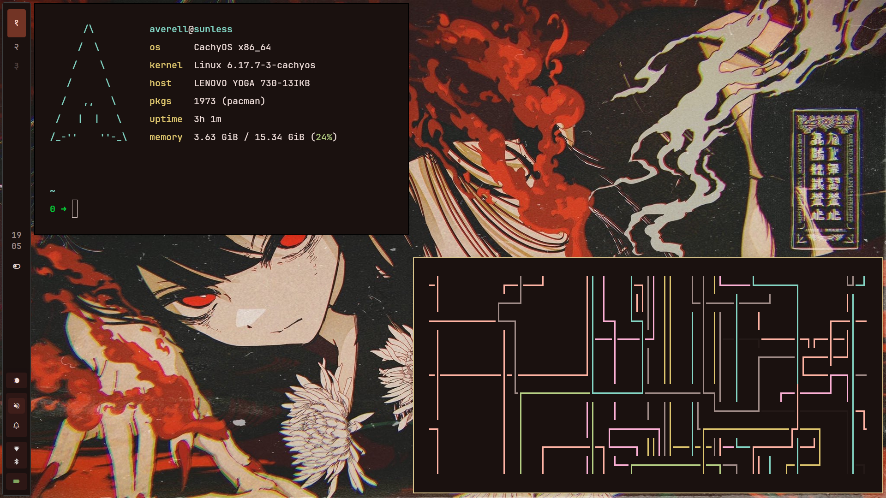
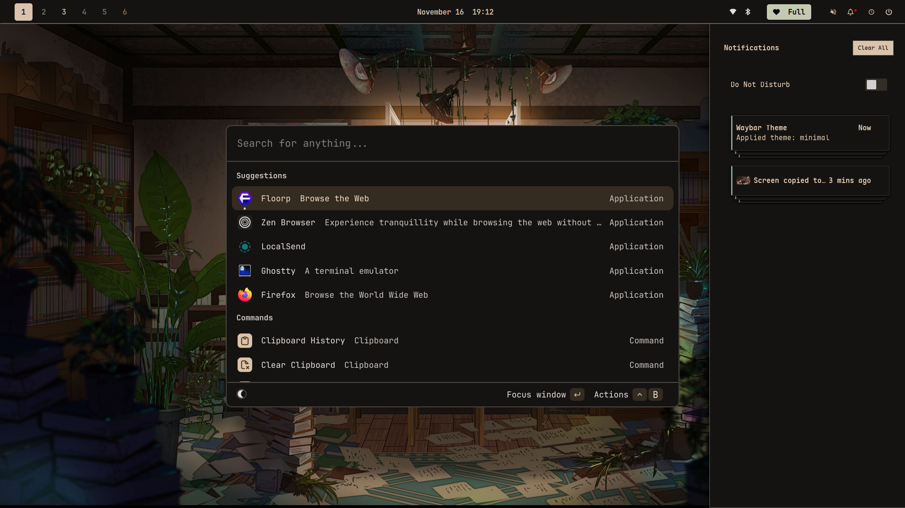
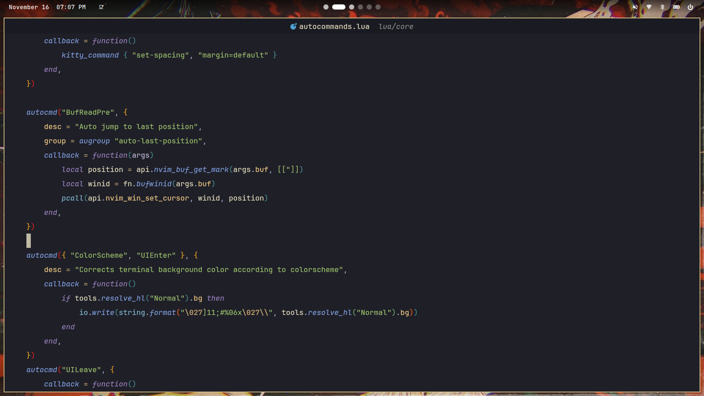
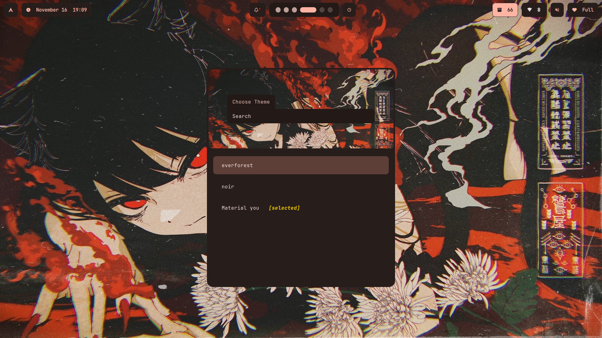
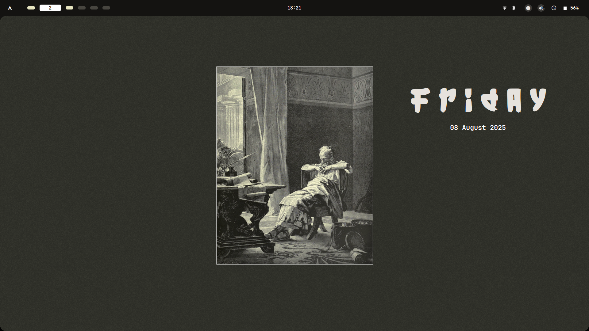
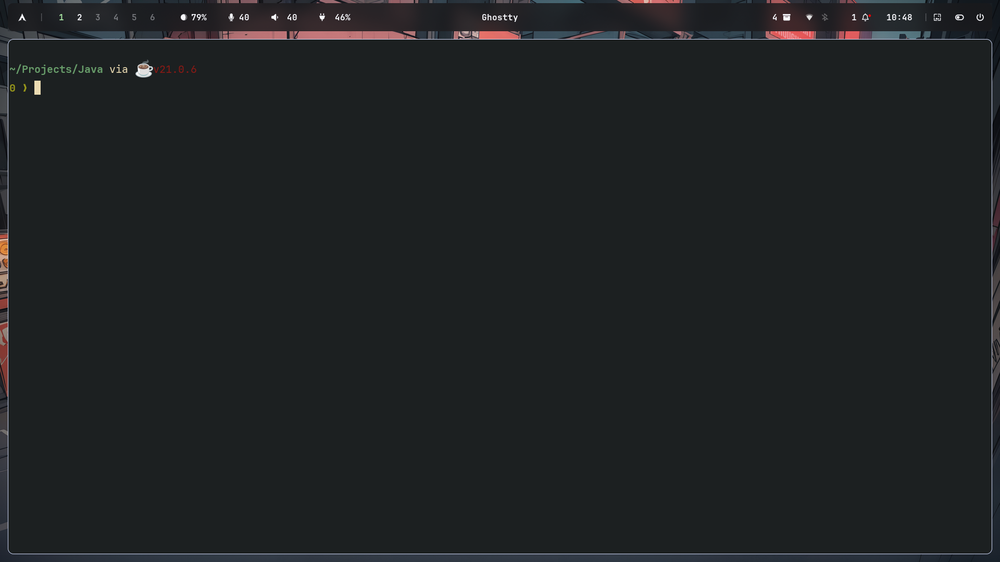

# My Dotfiles

This repository contains my personal dotfiles for various applications including Neovim, Hyprland, Waybar, Swaync, Swayosd, and Fabric.

## Screenshots








## Applications Configured

- **Neovim**: Custom configuration in `nvim/`
- **Hyprland**: Window manager setup in `hypr/`
- **Waybar**: Status bar configuration in `waybar/`
- **Swaync**: Notification center in `swaync/`
- **Swayosd**: On-screen display in `swayosd/`
- **Fabric**: Additional configurations in `fabric/`

## Installation with Stow

This repository uses [GNU Stow](https://www.gnu.org/software/stow/) to manage dotfiles by creating symlinks.

To install all dotfiles:

```bash
git clone https://github.com/AVER3LL/dots.git ~/.dotfiles
cd ~/.dotfiles
stow .
```

To install specific configurations:

```bash
stow ./.config/nvim
stow ./.config/hypr
stow ./.config/waybar
stow ./.config/swaync
stow ./.config/swayosd
stow ./.config/fabric
```

To remove symlinks:

```bash
stow -D nvim
```
